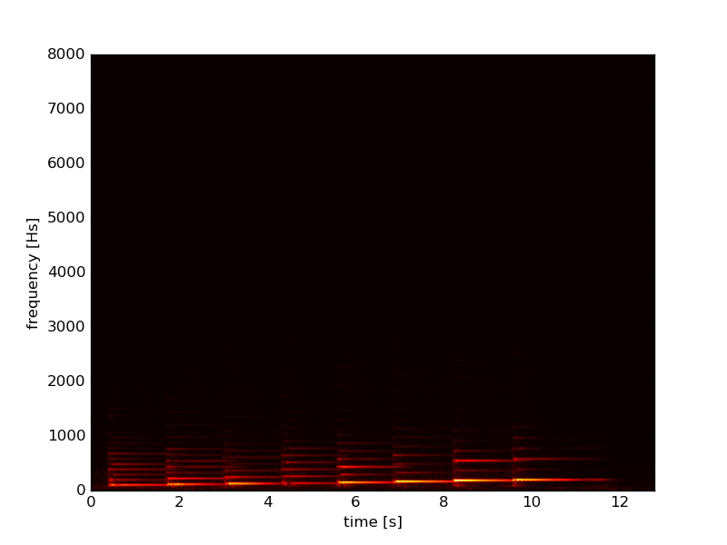
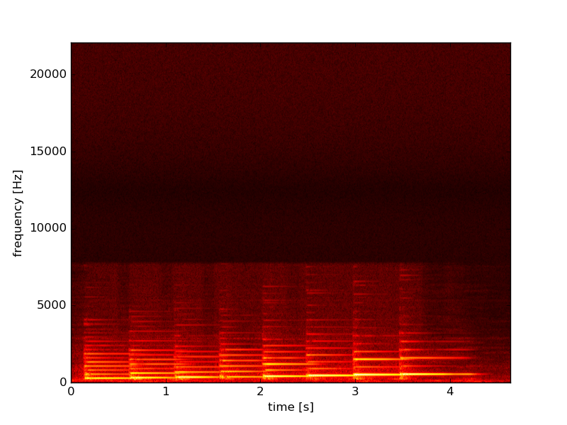

# STFT module for python

## Requirements

You first need to install `boost` and `pyublas`.

Some  common Python libraries are also required
(such as `numpy`, `scipy`, `matplotlib`). `wave`, an audio I/O library, is also required.

## Example
The output is a 2-dim numpy array.
So you can visualize the spectrogram of an audio file usint `matplotlib` as follows.

You can beutify this figure using some sophisticated functions of `matplotlib`. For example,

This figure seems a bit strange (the input audio file is not as long as 12 [s] !). We have set a wrong sampling rate (it shot be 44.1kHz but we have set 16 kHz). Executing the modifyied script `test.py` we obtain

There exists an unnatural horizontal line around 8000 Hz. No problem, this is the Nyquist frequency (half of the sampling rate) of the original recording.

## python3

- Reinstall `boost`, specifying the version of python to be 3.
